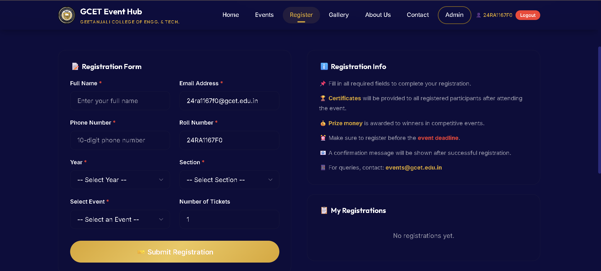
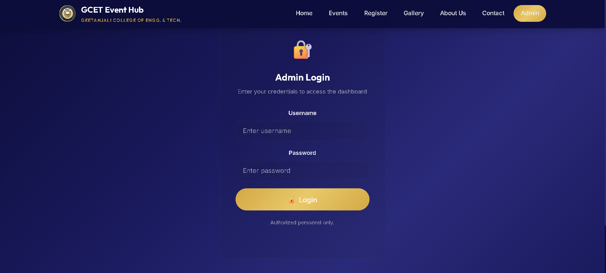
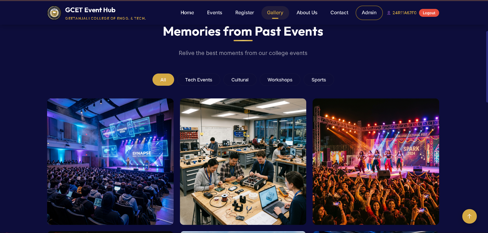

# 🎓 GCET Event Hub

A responsive web application to manage and explore college events like hackathons, workshops, cultural fests, and sports events.

## 🚀 Features

* Event browsing and filtering
* Student registration system
* Admin dashboard
* Gallery management
* Login system using sessionStorage

## 🛠️ Tech Stack

* HTML
* CSS
* JavaScript
* LocalStorage

## 🔗 Live Demo

https://adithya9262.github.io/gcet-event-hub/

## 📸 Screenshots

### 🏠 Home Page

### 📝 Registration Page

### 🔐 Login Page

### ⚙️ Admin Dashboard

### 🖼️ Gallery

